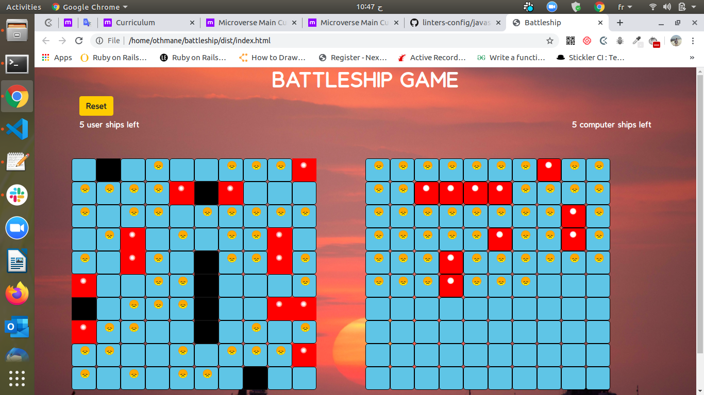

# PROJECT: Battleship
The Battleship project comes at the end of the JavaScript testing section. It tests the knowledge about Test Driven Development (TDD). It is a Test Driven Development of the Battleship game.

> This project is part of a series of projects to be completed by students of [Microverse](https://www.microverse.org/ 'The Global School for Remote Software Developers!').

## Live Demo

[Live Demo Link](https://rawcdn.githack.com/sumaerjolly/battleship/852aef9df203bdcda6547a817e3134c34ebdee06/dist/index.html) .

## Built With

- HTML
- CSS
- JavaScript (ES6/ES2015).
- ESlint
- Webpack

## Test With

- Jest

To get a local copy up and running follow these simple example steps.

### Prerequisites

1. Git.
2. Code editor.
3. Code linter.

## How to run the program

1. Open the terminal.

2. Enter `git clone https://github.com/sumaerjolly/battleship`.

3. Navigate to the cloned repository.

4. In the terminal cd into Battleship.

5. Run `npm install` in your terminal.

6. Run `npm run build` in your termianl.

7. Open index.html and enjoy the game.

## Author(s)

1. [Othamane Naamani](https://github.com/othman-19/).
2. [Sumaer Jolly](https://github.com/sumaerjolly/).

## 🤝 Contributing

Contributions, issues and feature requests are welcome!

Feel free to check the [issues page](issues/).

## Show your support

Give a ⭐️ if you like this project!
